# <div align="center">Leandro Nathanael Hermawan</div>

<div align="center">
  
</div>

## 🚀 About Me

I'm a vocational school student and a passionate developer
<div align="center">
  
</div>


## 🛠️ My Tech Stack
```javascript
const techStack = {
    operating_systems: [
        "Windows 11", 
        "Fedora 42 Hyprland"
    ],

    programming_languages: [
        "PHP",
        "Java",
        "Go",
        "TypeScript",
        "JavaScript"
    ],

    frameworks: [
        "React",
        "Vue",
        "Next.js",
        "Laravel",
        "Springboot",
        "Gin",
        "Tailwind CSS"
    ],

    tools: [
        "Git",
        "Docker",
        "Postman",
        "Nvim"
    ]
}
```

## 📊 GitHub Stats

<div align="center">
  <picture>
    <source srcset="pacman-contribution-graph-dark.svg">
    
  </picture>
</div>

<p align="center">
  <a href="https://github.com/LeleCodeDev?tab=repositories">
    
  </a>
  
</p>

 <p align="center">
  
  </p>

<p align="center"> 
  
</p>

## 🔗 Connect with Me

<div align="center">
  <a href="https://www.instagram.com/leandronathanael_08" target="_blank">
    
  </a>
  <a href="mailto:leandronathanael08@gmail.com">
    
  </a>
</div>

_Let's build something amazing together! 🚀_
